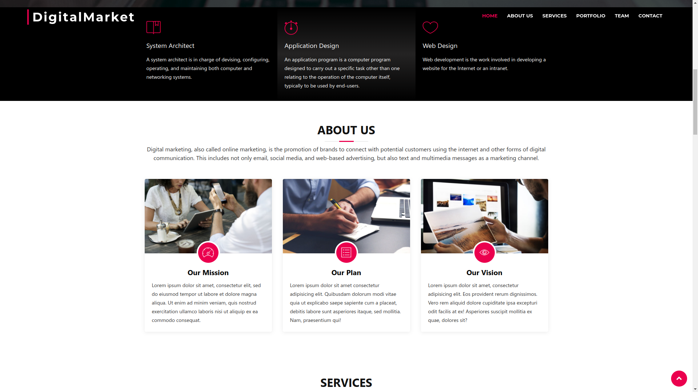
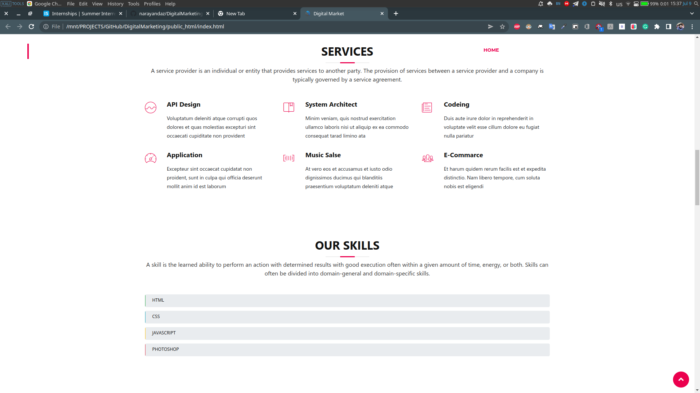
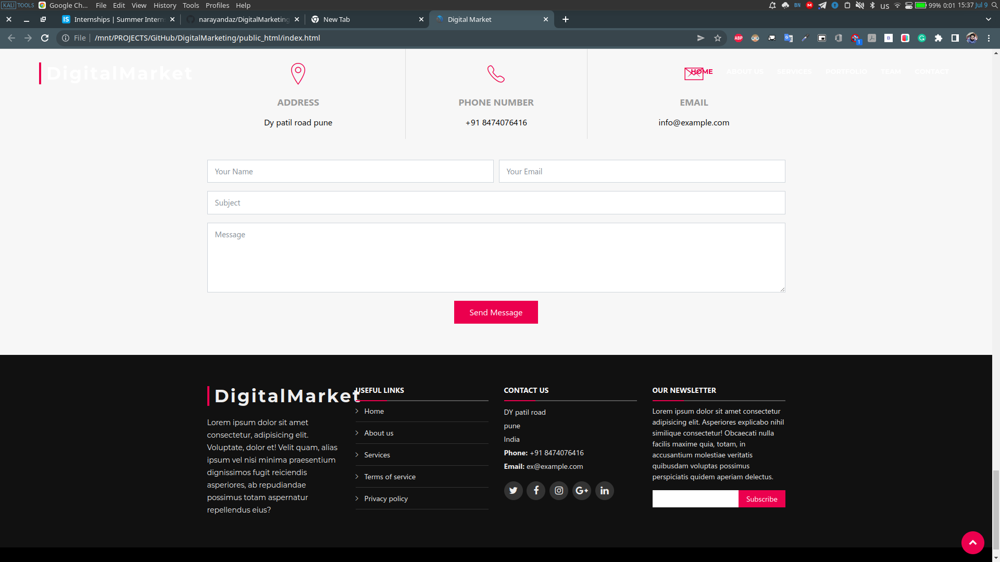
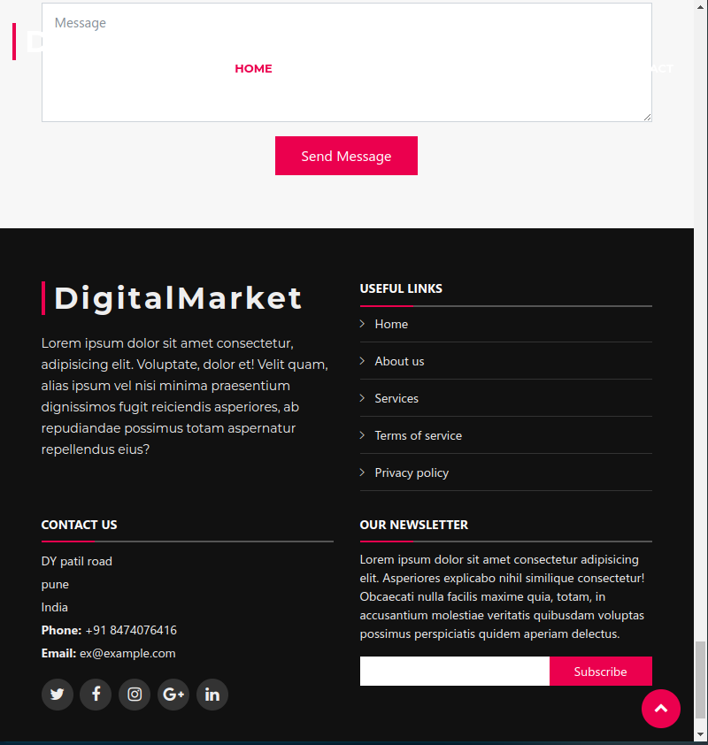
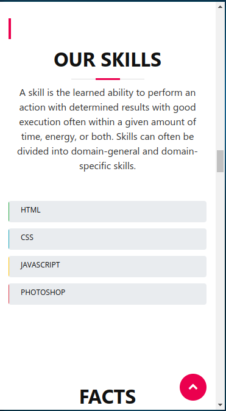
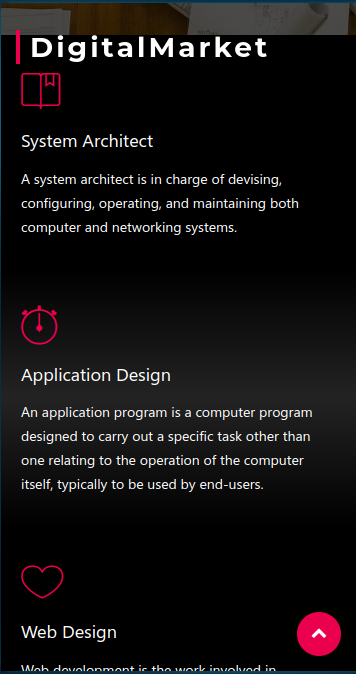
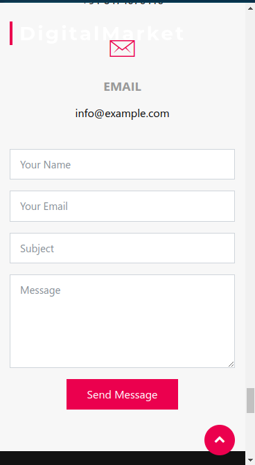

# DigitalMarketing
DigitalMarketing is a Website or HTML Template which is develop by HTML CSS JavaScript.  It is a Responsive web design It will automatically adjust for different screen sizes and viewports. Using Bootstrap and Google Fonts. I created some animations with CSS and JavaScript

# 
## Images:

#

#

#

#

#

#

#

#

